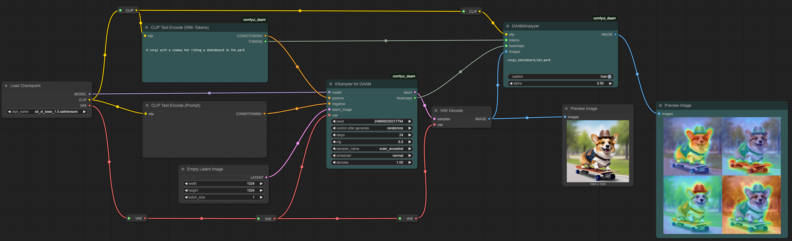
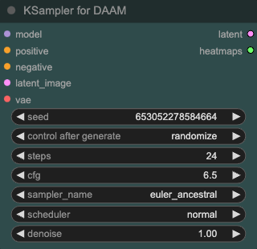
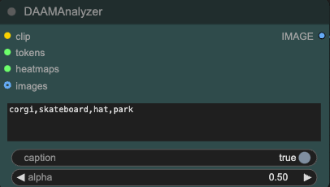
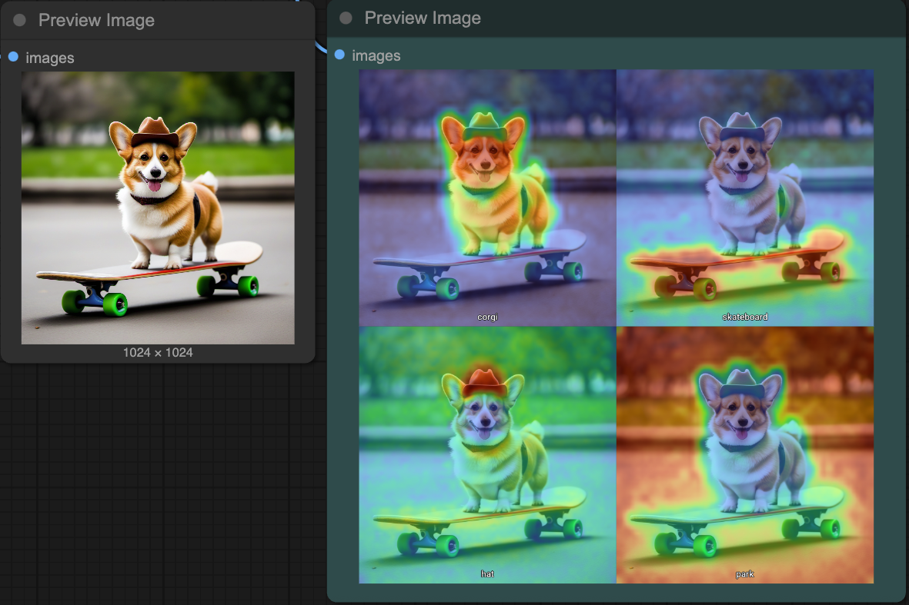
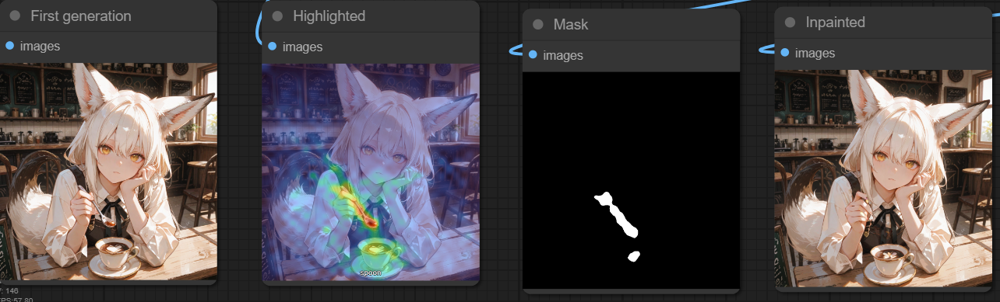

# ComfyUI DAAM

**ComfyUI custom nodes for [Diffusion Attentive Attribution Maps (DAAM)](https://github.com/castorini/daam)**

This extension enables visualization of cross-attention heatmaps within Stable Diffusion models, showing exactly which parts of the image correspond to specific words in the prompt — good for analyzing and debugging model outputs and LoRA training. This fork also addes node for extraction a mask by tokens.

👉 Example workflows are available in [workflows](./workflows).



This project was adapted from the [SD Web UI implementation](https://github.com/kousw/stable-diffusion-webui-daam) and based on [adaptation repository for ComfyUI](https://github.com/nisaruj/comfyui-daam).  Special thanks to [@kousw](https://github.com/kousw) for the original work and [@nisaruj](https://github.com/) for inspiring ComfyUI adaptation!

## ✨ Features
- ✅ Positive / Negative prompt heatmap visualization
- ✅ SDXL, SD1.5, SD3 support
- ✅ Flux Dev support (Beta)

## 🚀 Installation

### Manual Install

Clone this repo into your ComfyUI `custom_nodes` directory:

```bash
git clone https://github.com/nisaruj/comfyui-daam.git
```

Then install the required packages
```bash
cd comfyui-daam
python3 -s -m pip install -r requirements.txt
```

Restart ComfyUI.


## 🧩 DAAM Nodes

### `CLIPTextEncodeWithTokens`

Identical to `CLIPTextEncode` but also outputs the tokenized prompt required for the analysis.


### `KSamplerDAAM`

A hooked version of `KSampler`. During sampling, it records attention maps for later analysis.

**Outputs:**
- `latent` — standard latent output
- `pos_heatmaps` — positive prompt's raw heatmaps for input into the analyzer
- `neg_heatmaps` — negative prompt's raw heatmaps for input into the analyzer



### `DAAMAnalyzer`

This node generates overlay heatmaps that show which parts of the image correspond to selected words in the prompt.

**Inputs:**
- `clip` — CLIP model used to encode the attention text
- `tokens` — from `CLIPTextEncodeWithTokens`
- `heatmaps` — from `KSamplerDAAM`
- `images` — the output images to overlay the heatmaps
- A **text box** for comma-separated words to generate heatmaps

**Output:**
- A batch of images with word-level heatmaps overlaid




## 📷 Example Output

**Prompt:** A photo of corgi with a cowboy hat riding a skateboard in the park

**Attention words**: corgi,skateboard,hat,park



### `DAAM Mask From Tokens`

This node produces mask over image by your tokens. You can use this mask for inpainting.

**Inputs:**
- `clip` — CLIP model used to encode the attention text
- `tokens` — from `CLIPTextEncodeWithTokens`
- `heatmaps` — from `KSamplerDAAM`
- `images` — the output images to overlay the heatmaps
- A **text box** for comma-separated words to generate mask

**Output:**
- A mask



## 📦 Changelog

- **0.4.0**
    - Flux and SD3 initial support
    - Code Refactor and Minor bug fixes

- **0.3.0**
    - Negative prompt support
    - Code Refactor and Minor bug fixes

- **0.2.0**
    - Added support for batched inputs
    - SD 1.5 models compatibility
    - Bug fixes and stability improvements

- **0.1.1**
    - Initial Version with SDXL support

- **fork**
    - Minor fix for Flux
    - Added the node to generate mask by tokens